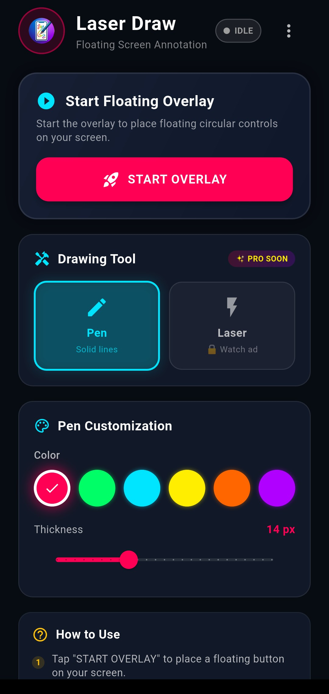
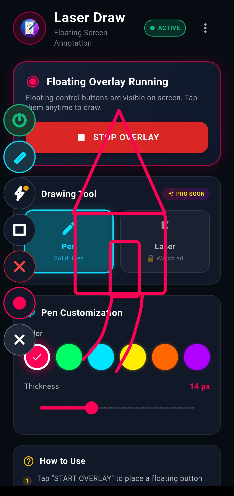
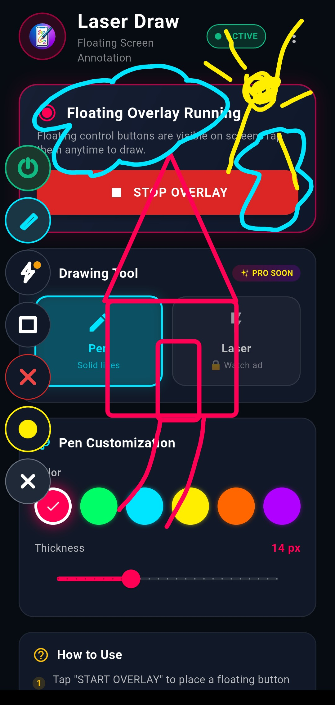

# 🖊️ Draw On Screen With Laser 🎯

> **The Ultimate Floating Screen Annotation & Laser Pointer Tool for Android!**  
> *Perfect for Students, Teachers, Presenters, Gamers, and Content Creators.*

---

**Watch Tutorial Here**:- https://youtube.com/shorts/j47HalB43Jg?si=29so0re-vuEUhYo_

---

## 🌟 Overview

**Draw On Screen With Laser** transforms your Android device into an interactive digital whiteboard and live presentation screen! With our intuitive **Floating Overlay Widget**, you can annotate, draw, highlight, and place geometric shapes directly over any app, PDF document, video, zoom call, or presentation without pausing your workflow.

Whether you're a student explaining notes, a teacher hosting online classes, or a presenter highlighting key details, **Draw On Screen With Laser** gives you the precision tools you need right at your fingertips.

---

## ✨ Features That Make Drawing Fun & Effortless

### 🪄 1. Magic Laser Pen Tool (With Auto-Fade)
- **Temporary Highlights:** Draw lines that automatically fade away! Perfect for pointing out temporary screen details during video calls or live lectures.
- **Customizable Fade Timeout:** Control exactly how long laser trails remain visible.
- **Adjustable Line Thickness:** Fine-tune stroke thickness from subtle pointers to bold highlights.
- **6 Vibrant Colors:** Red 🔴, Green 🟢, Blue 🔵, Yellow 🟡, Orange 🟠, Purple 🟣.

### ✏️ 2. Solid Normal Pen Tool
- **Persistent Annotations:** Draw permanent lines that stay on screen until you clear them.
- **Smooth Drawing Engine:** High-responsiveness touch support for clean handwriting and sketches.
- **6 Rich Palette Colors:** Red 🔴, Green 🟢, Blue 🔵, Yellow 🟡, Orange 🟠, Purple 🟣.

### 📐 3. Quick Shape Shortcuts
Instantly draw perfect geometric shapes with a single tap:
- ⭕ **Circle**
- 🔲 **Square**
- 🔺 **Triangle**
- 📏 **Straight Line**
- ➡️ **Arrow**
- ⭐ **Star**
- All shapes support all 6 vibrant color options!

### 🎈 4. Smart Floating Control Widget
- **Display Over Other Apps:** Works seamlessly on top of YouTube, PDF readers, browsers, Zoom, Meet, and games.
- **Draggable & Dockable:** Move the floating widget anywhere on your screen so it never blocks your view.
- **Minimize & Expand:** Hide the drawing menu with one touch to enjoy 100% screen visibility whenever needed.

---

## 📸 Screenshots

| 🎯 Laser Pointer & Customization | 📐 Quick Shape Shortcuts & Overlay | 🎈 Draggable Floating Control |
| :---: | :---: | :---: |
|  |  |  |

---

## 🎓 Why Students & Professionals Love It

- 📚 **Study & Revision:** Circle key formulas and underline textbook passages while reading PDFs.
- 🎓 **Online Teaching:** Highlight slides and draw diagrams live during Google Meet or Zoom sessions.
- 🎥 **Video Recording:** Create tutorial videos with live visual pointers and annotations.
- 🎮 **Gaming & Streaming:** Point out strategies and map locations in real-time.
- 🚀 **Lightweight & Fast:** Starts instantly with minimal battery and RAM footprint.
- 🛡️ **Privacy Focused:** Works 100% offline — no personal data collected or transmitted.

---

## 🚀 Future Roadmap & Upcoming Features

- 💎 **Pro Version Coming Soon!**  
  Stay tuned for exciting premium features including:
  - 🎨 Unlimited custom color picker & gradients
  - 📝 Text annotation overlay tool
  - 💾 Screenshot capture with saved drawings
  - 🔍 Spotlight focus mode & magnifier
  - 🔤 Custom brush styles & highlighter markers

---

## 📲 How to Install & Run

1. Download the latest `app-release.apk` from the [Releases](https://github.com/rishibanota/draw-on-screen-with-laser/releases) section.
2. Install the APK on your Android device (Enable *"Install from Unknown Sources"* if prompted).
3. Open **Draw On Screen With Laser** and grant the **Display Over Other Apps** permission.
4. Tap **Start Floating Tool**, and enjoy drawing anywhere on your screen!

---

## 📄 License & Feedback

Distributed under the MIT License. Feel free to use, modify, and share!

💬 **Got Feedback or Suggestions?**  
We’d love to hear from you! Open an issue or submit a pull request to help make **Draw On Screen With Laser** even better.
